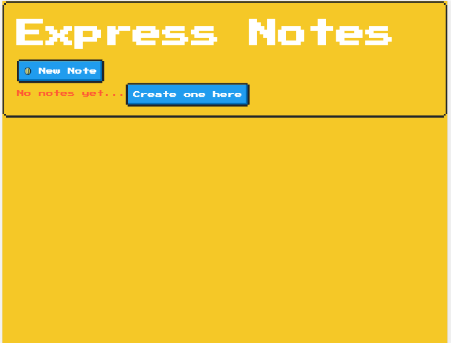
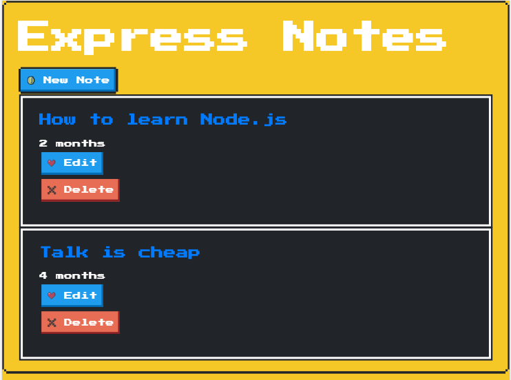
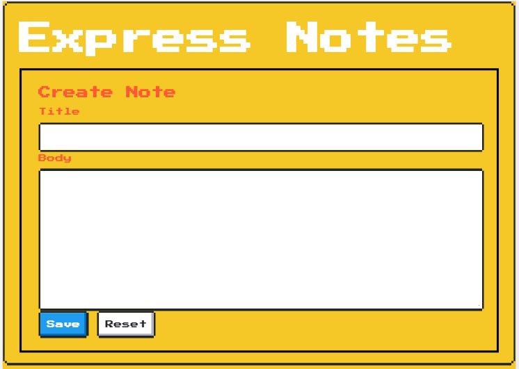
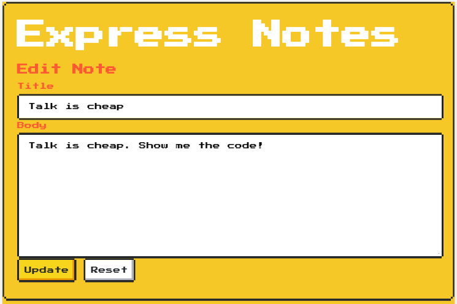

<h2 align="center"> halo-express </h2>
<h2 align="center">project Node.js from book "Halo Web Server with Express". https://rizafahmi.com/bukuexpress/</h2>

## Spesifikasi Project

- Express.js
- EJS template

## Screenshots

1. Halaman utama tanpa data
   
2. Halaman utama dengan sample data
   
3. Create a note
   
4. Edit a note
   
